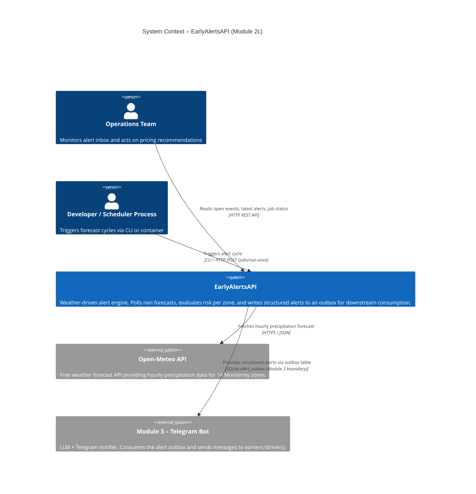

# C1 – System Context Diagram

Shows **EarlyAlertsAPI** in its environment: who uses it and which external systems it interacts with.

## Key points

| Participant | Role |
|---|---|
| **Open-Meteo** | Only external network dependency. One batch HTTPS call per cycle for all 14 zone centroids. |
| **alert_outbox** | Formal handoff table to Module 3. Module 3 never re-fetches weather data. |
| **Operations** | Reads REST API for monitoring (`/health`, `/alerts/latest`, `/events/open`). |
| **Scheduler process** | Triggers `run_cycle()` periodically; runs in a dedicated container to avoid duplicate cycles. |
