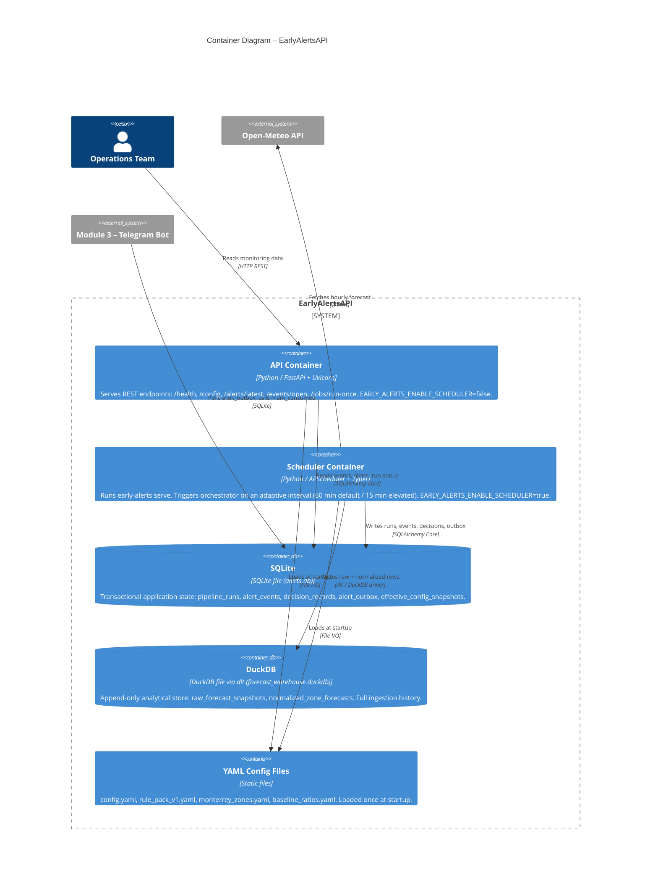

# C2 – Container Diagram

Shows the **processes, services, and data stores** that make up EarlyAlertsAPI.

## Storage split rationale

| Store | Technology | Responsibility |
|---|---|---|
| **SQLite** | SQLAlchemy Core | Low-latency transactional state (events, outbox, runs). Single-writer, crash-safe. |
| **DuckDB** (via dlt) | dlt + DuckDB driver | Append-only analytical history. Full raw + normalised forecast archive for replay and dashboards. |

The two stores are independent failure domains: DuckDB ingest failure is non-fatal to the alert cycle.

## Scheduler singleton pattern

`EARLY_ALERTS_ENABLE_SCHEDULER` controls whether a process starts APScheduler.  
In Docker Compose the **scheduler** service sets it `true`; all **api** workers leave it `false`.  
This prevents duplicate `run_cycle()` calls.
