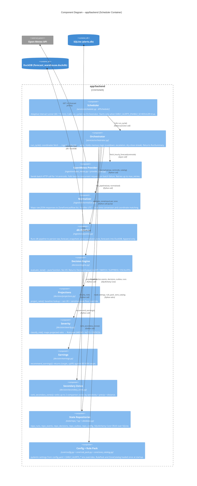

# C3 – Component Diagram

Shows the **components inside the backend Python package** (`app/backend/`).

## Component summary

| Component | Pattern | CC |
|---|---|---|
| `orchestrator.py` | Coordinator – stateful cycle logic | ≤ B |
| `engine.py` | Pure function – zero I/O | ≤ A |
| `projections.py` | Pure function – baseline lookup + lift | ≤ A |
| `severity.py` | Pure function – threshold lookup | ≤ A |
| `earnings.py` | Pure function – single comparison | ≤ A |
| `secondary_zones.py` | Pure function – sort + slice | ≤ A |
| `scheduler.py` | APScheduler wrapper | ≤ A |
| `repo_*.py` | Repository – SQLAlchemy Core CRUD | ≤ A each |
