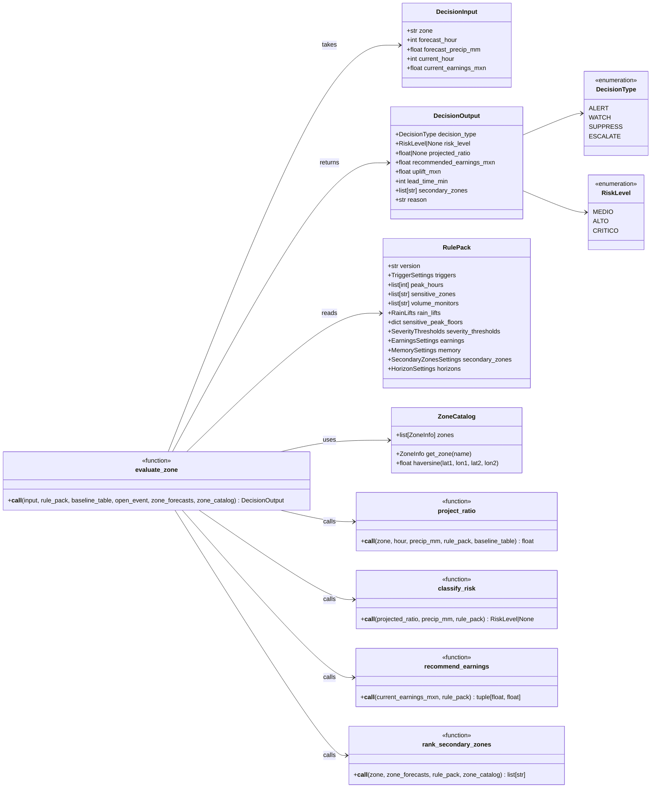
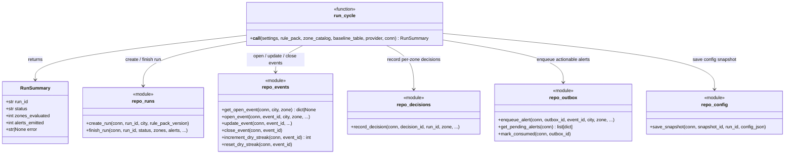
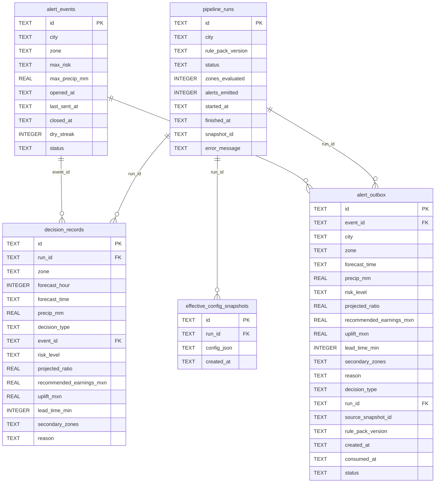

# C4 – Code Diagram

Shows the **key classes, models, and call relationships** inside the Decision Engine and Orchestrator components.

## Decision Engine internals

## Orchestrator → State interaction

## Table definitions (SQLite)

