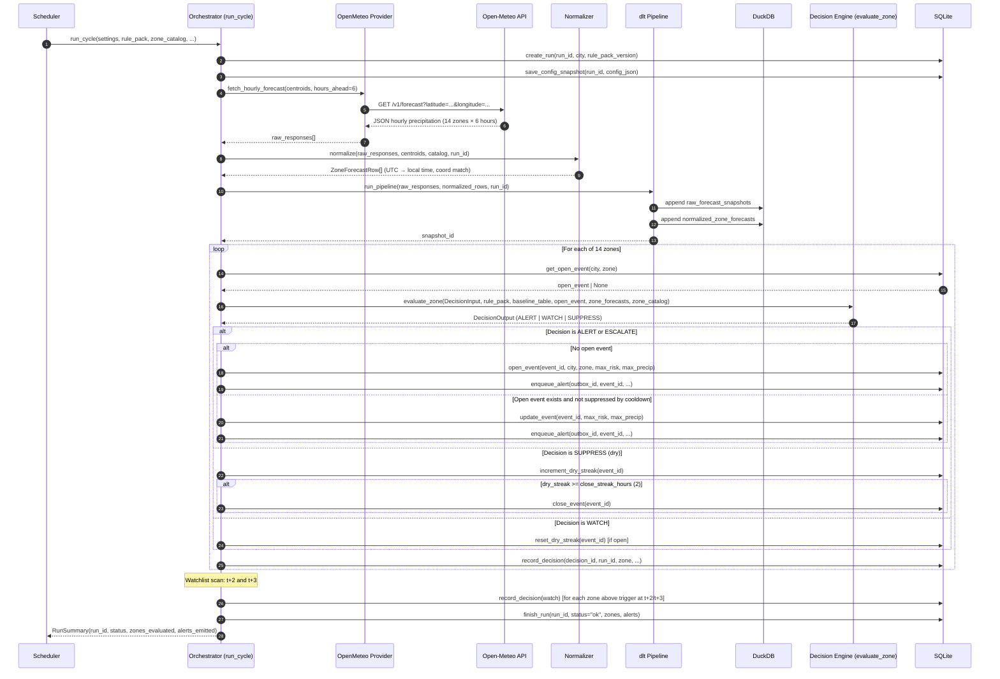
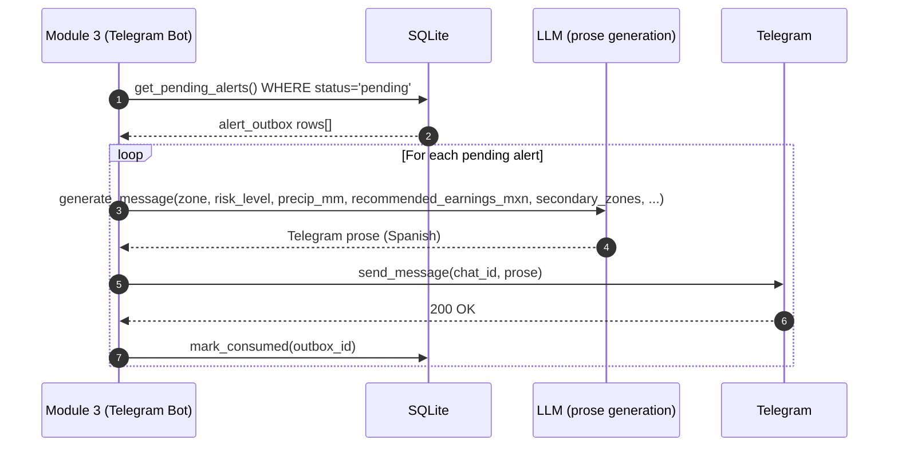
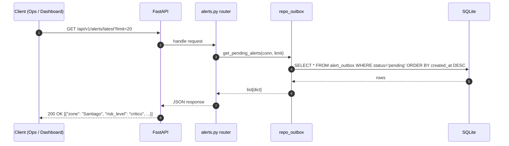
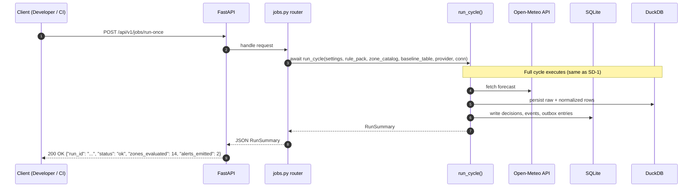
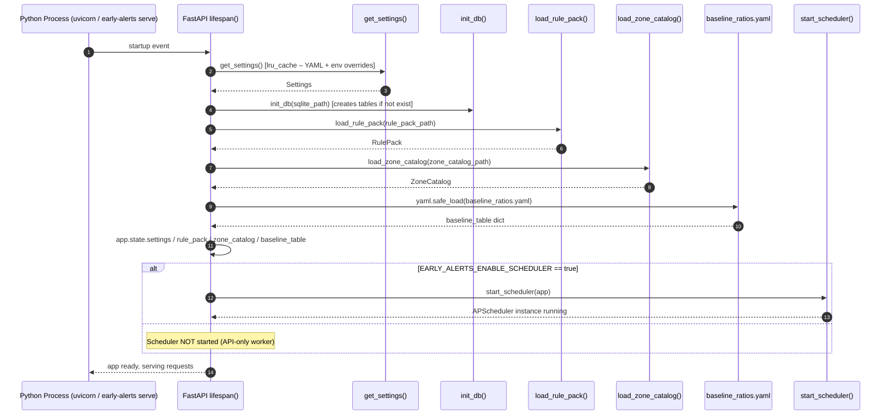

# Sequence Diagrams

## SD-1 – Full alert cycle (`run_cycle`)

Shows one complete execution of the orchestrator cycle, from scheduler trigger to outbox write.

---

## SD-2 – Module 3 outbox consumption

Shows how Module 3 (Telegram Bot) reads from the outbox without re-running weather logic.

---

## SD-3 – API request: GET /alerts/latest

Shows the synchronous read path through the REST API.

---

## SD-4 – POST /jobs/run-once (manual trigger)

Shows how a developer or operator triggers a single alert cycle via the REST API.

---

## SD-5 – Startup (FastAPI lifespan)

Shows how the application initialises resources when the process starts.

