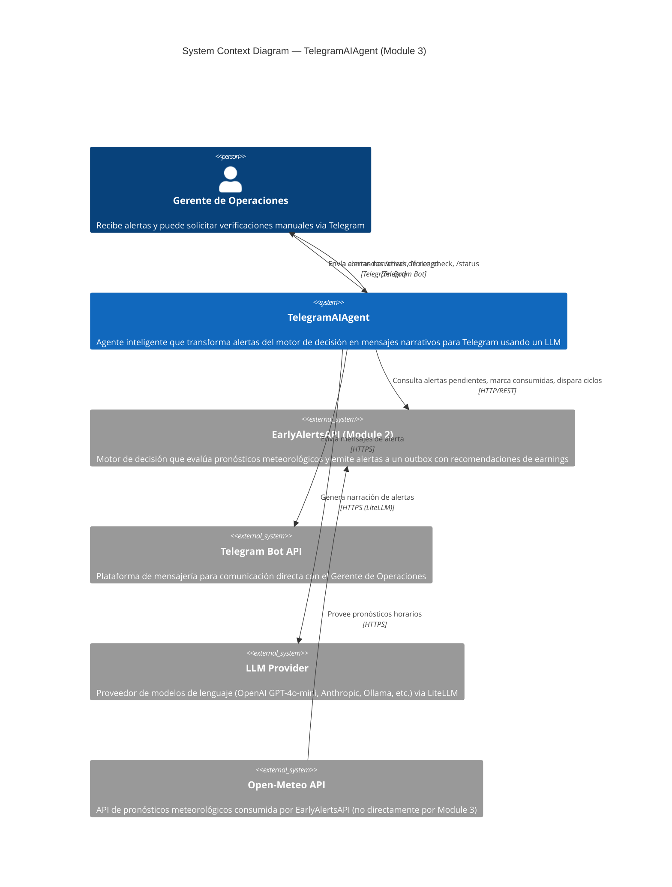

# C1 — System Context Diagram

> Shows the TelegramAIAgent system in context: who uses it, and what external systems it interacts with.

## Descripción

| Elemento | Rol |
|---|---|
| **Gerente de Operaciones** | Usuario final. Recibe notificaciones push de alertas y puede interactuar manualmente con el bot. |
| **TelegramAIAgent** | El sistema bajo análisis. Orquesta la transformación de alertas crudas del motor en mensajes Telegram enriquecidos, usando un LLM para generación de texto natural. |
| **EarlyAlertsAPI** | Sistema externo (Module 2). Produce las alertas en su outbox (zona, nivel de riesgo, precipitación, earnings recomendados, etc.). |
| **Telegram Bot API** | Canal de comunicación con el usuario final. |
| **LLM Provider** | Servicio externo de IA generativa. Configurable via LiteLLM (OpenAI, Anthropic, Ollama, Azure). |
| **Open-Meteo API** | Fuente de datos meteorológicos — consumida por Module 2, no directamente por Module 3. |
