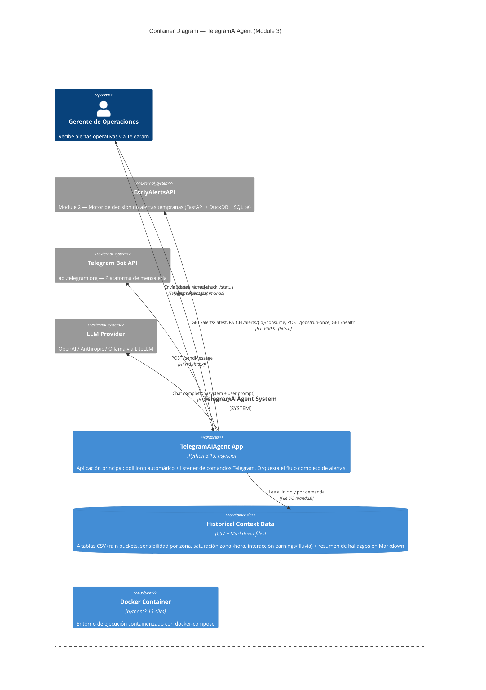

# C2 — Container Diagram

> Zooms into the TelegramAIAgent system boundary, showing the containers (deployable units) and how they communicate.

## Containers

| Container | Tecnología | Responsabilidad |
|---|---|---|
| **TelegramAIAgent App** | Python 3.13, asyncio, pydantic-settings | Proceso principal que ejecuta dos tareas concurrentes: (1) poll loop automático cada N segundos, (2) listener de comandos Telegram. Contiene la lógica de orquestación, integración con LLM, y envío de mensajes. |
| **Historical Context Data** | 4 CSV + 1 Markdown | Datos estáticos del Módulo 1 de análisis (30 días históricos de Monterrey). Cargados en memoria al inicio. Rutas configurables via env vars. |
| **Docker Container** | python:3.13-slim, docker-compose | Empaquetado de la aplicación. Se conecta a la red Docker de EarlyAlertsAPI. |

## Comunicación entre Containers

| Origen | Destino | Protocolo | Detalle |
|---|---|---|---|
| Agent App | EarlyAlertsAPI | HTTP REST | 4 endpoints: fetch pending, consume, run-once, health |
| Agent App | Telegram Bot API | HTTPS | `POST /sendMessage` para enviar alertas |
| Agent App | LLM Provider | HTTPS | `litellm.acompletion()` — provider-agnostic |
| Agent App | Historical Data | File I/O | `pandas.read_csv()` + `Path.read_text()` al startup |
