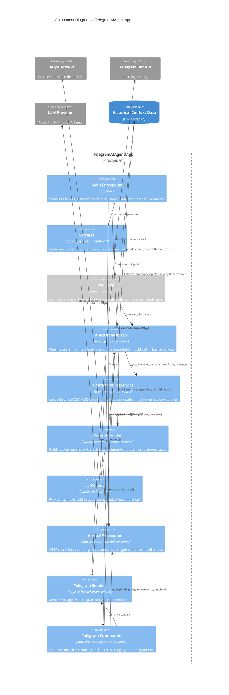

# C3 — Component Diagram

> Zooms into the TelegramAIAgent App container, showing the internal components (modules) and their interactions.

## Components

| Componente | Módulo | Responsabilidad |
|---|---|---|
| **Main Entrypoint** | `app.main` | Punto de entrada. Instancia todos los servicios, construye el system prompt, arranca el poll loop y el listener de Telegram concurrentemente con `asyncio`. |
| **Settings** | `app.config` | Configuración centralizada con `pydantic-settings`. Lee de `.env` o variables de entorno. Incluye tokens, modelo LLM, URL de la API, intervalo de polling, y rutas de archivos de contexto. |
| **Poll Loop** | `app.main.poll_loop()` | Bucle infinito asíncrono. Cada `poll_interval_seconds` consulta alertas pendientes, las procesa por el pipeline completo, y las marca como consumidas. |
| **AlertOrchestrator** | `app.agent.orchestrator` | Pipeline central: recibe un alert dict crudo → extrae hora → obtiene contexto histórico → construye user message → llama al LLM → retorna texto formateado para Telegram. |
| **ContextSourceService** | `app.agent.context_source` | Carga los 4 CSV y 1 Markdown al inicio desde rutas configurables. Construye dicts indexados para lookup O(1) por zona, hora, bucket de lluvia, y cuartil de earnings. Método `reload()` para actualización en runtime. |
| **Prompt Builder** | `app.agent.prompts.system_prompt` | Construye el system prompt (inyecta resumen histórico) y el user message por alerta. Incluye template completo (con historia) y fallback (sin historia). Mapea niveles de riesgo a display labels. |
| **LLMClient** | `app.agent.llm.client` | Wrapper sobre `litellm.acompletion()`. Provider-agnostic: cambiar de OpenAI a Anthropic/Ollama requiere solo cambiar env vars. Timeout de 30s. |
| **AlertsAPIConsumer** | `app.services.alerts_api.consumer` | Cliente HTTP para EarlyAlertsAPI. 4 métodos: `fetch_pending_alerts()`, `mark_consumed()`, `trigger_run_once()`, `get_health()`. Usa `httpx.AsyncClient`. |
| **Telegram Sender** | `app.services.telegram.sender` | Función `send_message()` que envía texto plano via Bot API. Trunca a 4096 chars (límite Telegram). Manejo de errores con logging. |
| **Telegram Commands** | `app.services.telegram.commands` | Registra handlers para `/check`, `/force_check`, `/status` en una `Application` de python-telegram-bot. Cada comando ejecuta el mismo pipeline que el poll loop. |
