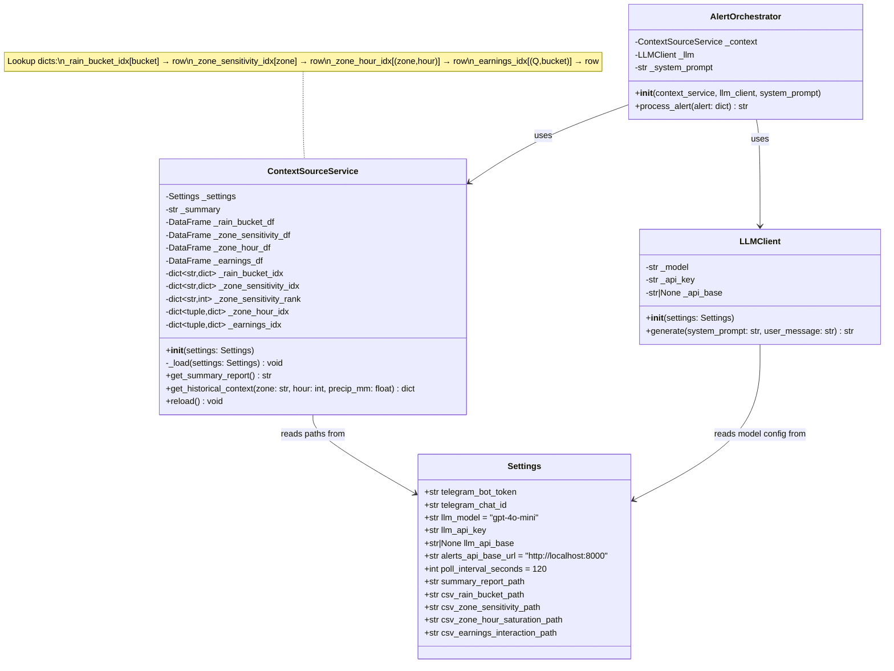
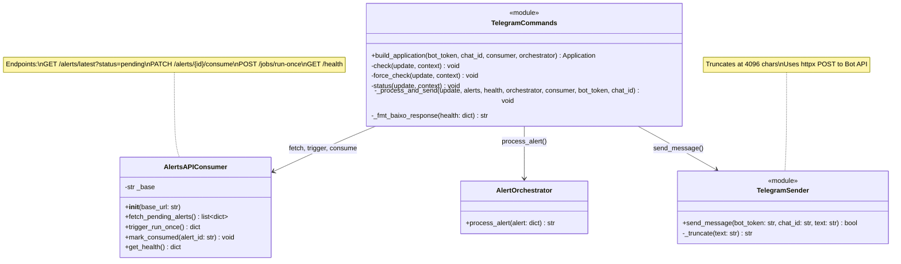
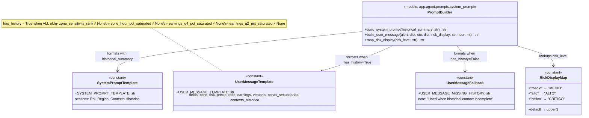
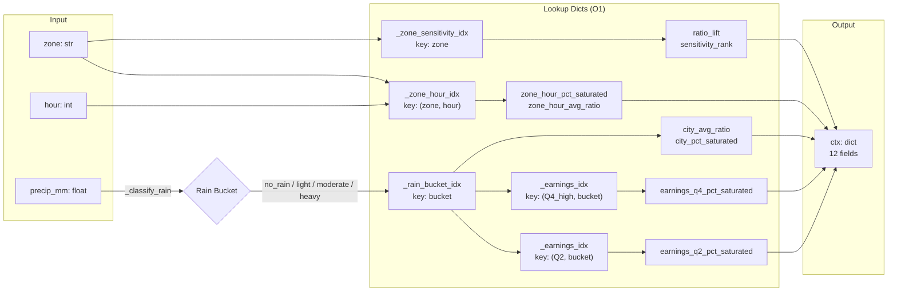
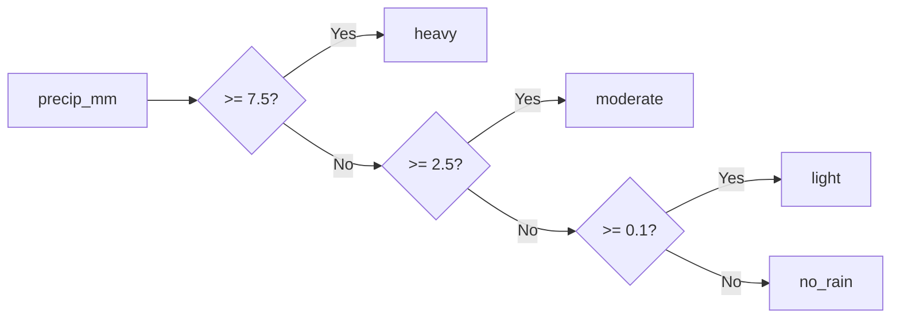

# C4 — Code Diagram

> Deepest level of the C4 model. Shows the internal structure of the key components: classes, methods, data structures, and their relationships.

## 4.1 Agent Layer — Core Pipeline

## 4.2 Services Layer — External Integrations

## 4.3 Prompt Engineering — Templates and Formatting

## 4.4 Data Flow — Historical Context Lookup

## 4.5 Rain Bucket Classification

| Bucket | Rango (mm/hr) |
|---|---|
| `no_rain` | 0.0 – 0.1 |
| `light` | 0.1 – 2.5 |
| `moderate` | 2.5 – 7.5 |
| `heavy` | ≥ 7.5 |
