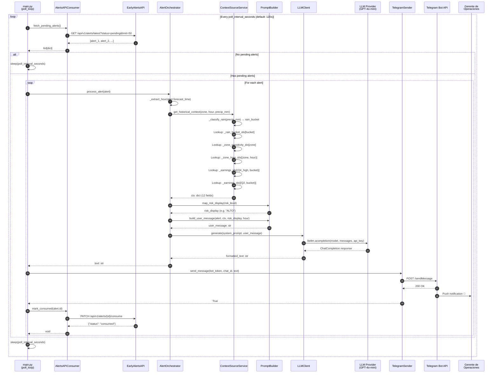
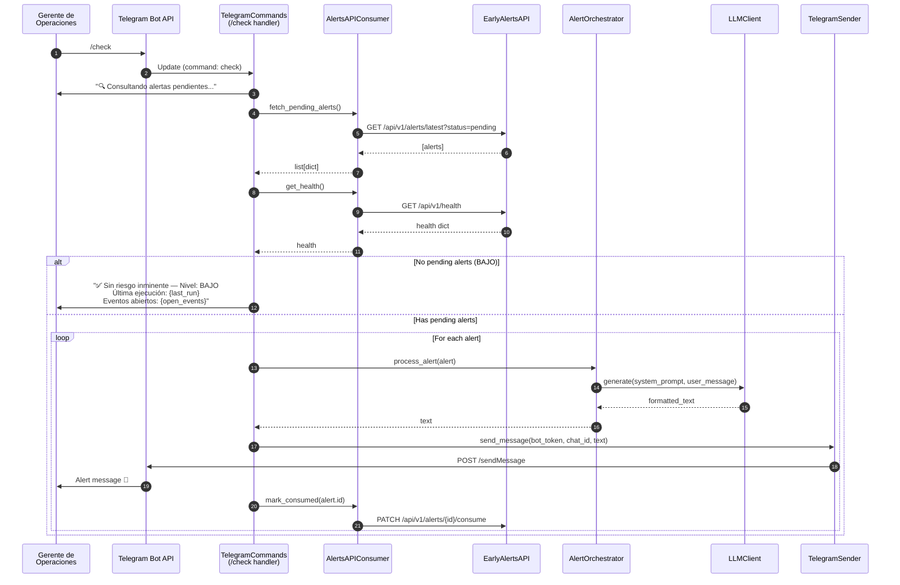
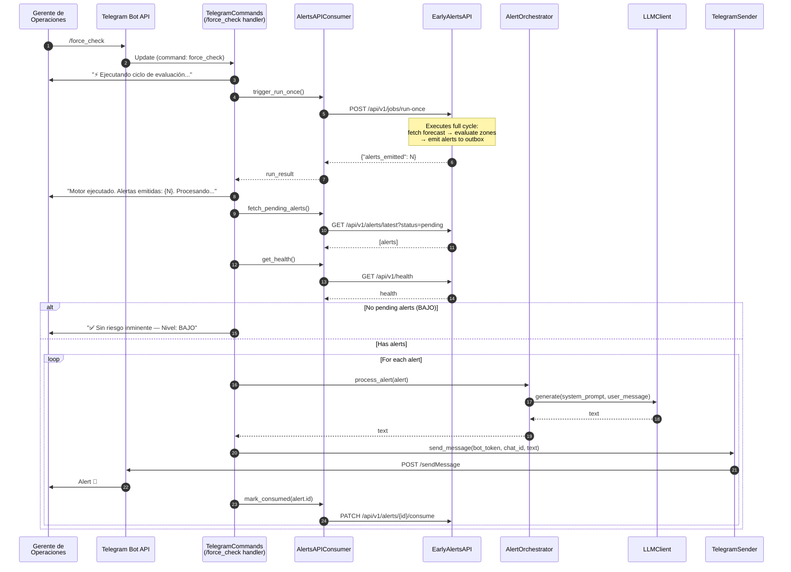
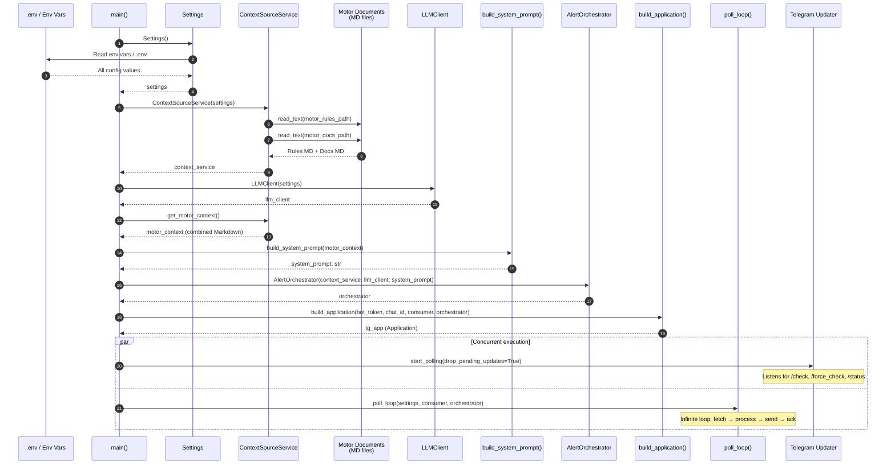

# Sequence Diagrams

> Shows the step-by-step message flow for the two main operational scenarios: automatic polling and manual Telegram commands.

## 1. Auto Poll Loop — Automatic Alert Processing

## 2. Manual Command — /check

## 3. Manual Command — /force_check

## 4. Startup — System Initialization

